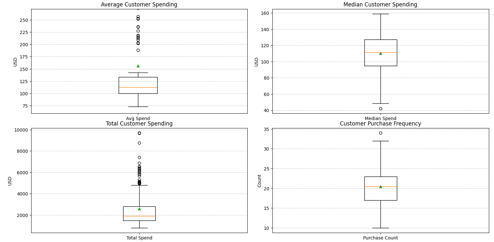
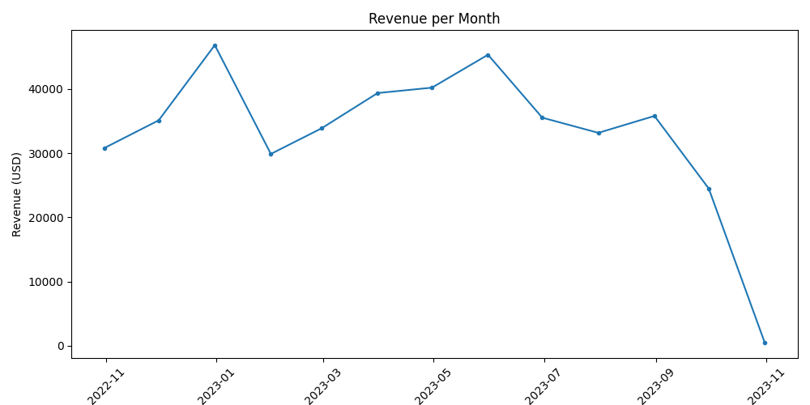
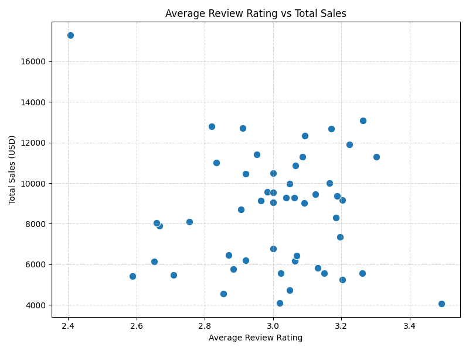

# Fashion Retail Sales Analysis

This project is an end-to-end analysis of customer purchase data from a fashion retailer. It explores trends in revenue, customer behavior, product popularity, and customer review ratings using Python and Jupyter Notebook.

---

## Features

- Revenue trends over time (daily, weekly, monthly)
- Customer spending behavior:
  - Total, average, and median spend
  - Purchase frequency
- Top-selling items
- Review rating distribution by item
- Correlation between reviews and total sales

---

## Project Structure

```
fashion_sales_analysis/ 
├── data/ │ 
  └── Fashion_Retail_Sales.csv 
├── fashion_sales_data.py 
├── fashion_sales_analysis.ipynb 
└── README.md
```

---

## Technologies Used

- Python 3.11+
- pandas
- matplotlib
- seaborn
- Jupyter Notebook
- VS Code

---

## Sample Output






---

## Key Insights

- Revenue peaked during December and May.
- Most customers spend around **$100–130** per purchase.
- Total spend does not strongly correlate with purchase frequency — some customers buy fewer but more expensive items.
- Higher review ratings do **not** guarantee higher product sales.
- A few products dominate revenue despite having average or below-average review scores.

---

## How to Run

1. Clone the repo or download the files.
2. Make sure the CSV file is in `data/`
3. Open `fashion_sales_analysis.ipynb` in Jupyter Notebook
4. Run the notebook step-by-step

> ⚠️ If you run `fashion_sales_data.py` directly, make sure you're in the `fashion_sales_analysis/` folder, or the data path may break.  
> Tip: Add this at the top of the script to fix it permanently:
> ```python
> import os; os.chdir(os.path.dirname(__file__))
> ```

---

## 🧠 Future Ideas

- Create a Streamlit dashboard for interactive data exploration
- Add SQL support for querying data
- Use machine learning to predict customer spend

---

## 🙌 Author

**Gabe Gamble**  
Built for a personal portfolio and to explore real-world Python data analysis.

---

Let me know if you want a version with screenshots or badges. Once that’s saved, you’re ready to push everything to GitHub! Want help with the push?
